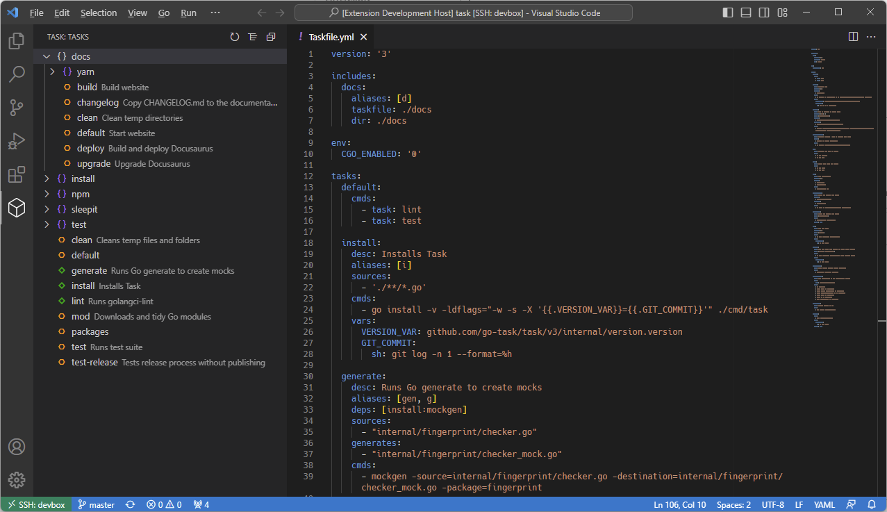

  
  

  <h1>Task for Visual Studio Code</h1>

  

    <a href="https://taskfile.dev">Task</a> is a task runner / build tool that aims to be simpler and easier to use than, for example, <a href="https://www.gnu.org/software/make/">GNU Make<a>.
  

  

    <a href="https://taskfile.dev/installation/">Installation</a> | <a href="https://taskfile.dev/usage/">Documentation</a> | <a href="https://twitter.com/taskfiledev">Twitter</a> | <a href="https://fosstodon.org/@task">Mastodon</a> | <a href="https://discord.gg/6TY36E39UK">Discord</a>
  

## Installation

- [Visual Studio Code | Visual Studio Marketplace](https://marketplace.visualstudio.com/items?itemName=task.vscode-task)
- [VSCodium | Open VSX Registry](https://open-vsx.org/extension/task/vscode-task)

## Features

- View tasks in the sidebar.
- Run tasks from the sidebar and command palette.
- Go to definition from the sidebar and command palette.
- Run last task command.
- Multi-root workspace support.
- Initialize a Taskfile in the current workspace.

---

## Configuration

| Setting           | Type      | Allowed Values                    | Default     | Description                                                                                  |
| ----------------- | --------- | --------------------------------- | ----------- | -------------------------------------------------------------------------------------------- |
| `updateOn`        | `string`  | `"manual"`, `"save"`              | `"save"`    | When the list of tasks should be updated.                                                    |
| `path`            | `string`  |                                   | `"task"`    | Path to the Task binary. Can also the name of a binary in your `$PATH`.                      |
| `outputTo`        | `string`  | `"output"`, `"terminal"`          | `"output"`  | Where to print the output of tasks. Note that the output panel does not support ANSI colors. |
| `checkForUpdates` | `boolean` |                                   | `true`      | Check if there is a newer version of Task on startup.                                        |
| `tree.nesting`    | `boolean` |                                   | `true`      | Whether to nest tasks by their namespace in the tree view.                                   |
| `tree.sort`       | `sort`    | `default`, `alphanumeric`, `none` | `"default"` | The order in which to display tasks in the tree view.                                        |
